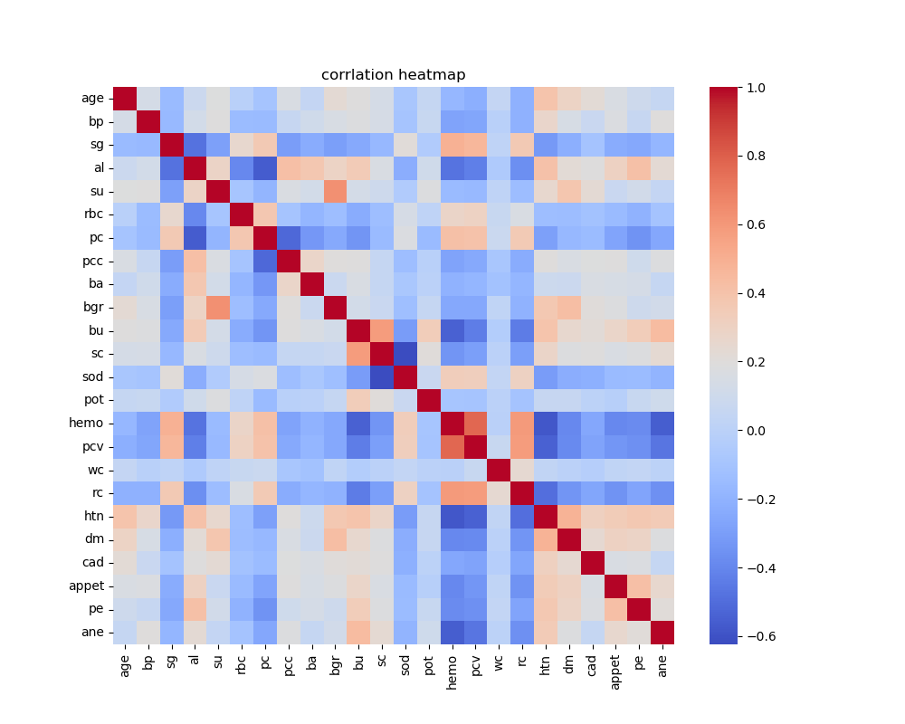
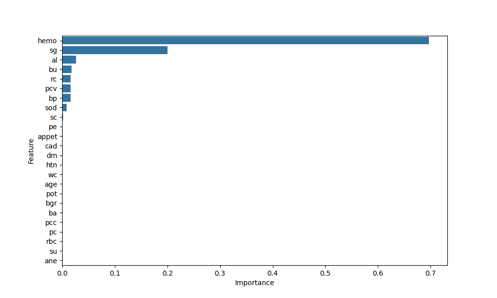
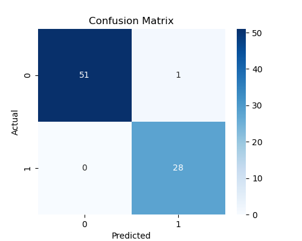

# CKD-Prediction-Using-Decision-Tree


Machine Learning project for predicting Chronic Kidney Disease using Decision Tree.

# 🩺 Chronic Kidney Disease Prediction using Decision Tree

## 📌 Project Overview

This project predicts whether a patient has Chronic Kidney Disease (CKD) using a Decision Tree Classifier. The project includes data preprocessing, exploratory data analysis (EDA), feature selection, model building, and performance evaluation.

---

## 📁 Repository Structure

```
CKD-Prediction-Using-Decision-Tree/
│── CKD_DecisionTree_Prediction.ipynb
│── README.md
│── confusion_matrix.png
│── feature_importance.png
│── heatmap.png
│── kidney_disease.csv
```

---

## ▶️ How to Run

1. Clone the repository
2. Install dependencies

```bash
pip install pandas numpy matplotlib seaborn scikit-learn
```

3. Open

```text
CKD_DecisionTree_Prediction.ipynb
```

4. Run all cells.

---

## 📂 Dataset

- Dataset: Chronic Kidney Disease Dataset
- Number of Records: 400
- Number of Features: 24
- Target Variable: Classification (CKD / Not CKD)

---

## 🛠 Technologies Used

- Python
- Pandas
- NumPy
- Matplotlib
- Seaborn
- Scikit-learn
- Jupyter Notebook

---

## 📊 Project Workflow

```text
Dataset
   │
   ▼
Data Preprocessing
   │
   ▼
Exploratory Data Analysis (EDA)
   │
   ▼
Feature Selection
   │
   ▼
Train-Test Split
   │
   ▼
Decision Tree Classifier
   │
   ▼
Model Evaluation
   │
   ▼
Prediction
```

---

## 🤖 Machine Learning Algorithm

- Decision Tree Classifier

---

## 📈 Model Performance

| Model | Accuracy |
|--------|----------|
| Decision Tree (All Features) | 97.50% |
| Decision Tree (Top Features) | 98.75% |

---

## ✨ Features

- Missing Value Imputation
- Label Encoding
- Correlation Heatmap
- Feature Importance Analysis
- Decision Tree Classification
- Model Comparison

---

## 📷 Project Visualizations

### Correlation Heatmap



### Feature Importance



### Confusion Matrix



---

## 🚀 Future Improvements

- Hyperparameter tuning using GridSearchCV
- Compare Decision Tree with Random Forest and XGBoost
- Deploy the model using Flask or Streamlit
- Perform cross-validation
- Improve feature engineering

---

## 📌 Conclusion

The Decision Tree model achieved high accuracy in predicting Chronic Kidney Disease. Feature selection reduced the number of input features while maintaining excellent model performance, making the model simpler and easier to interpret.
